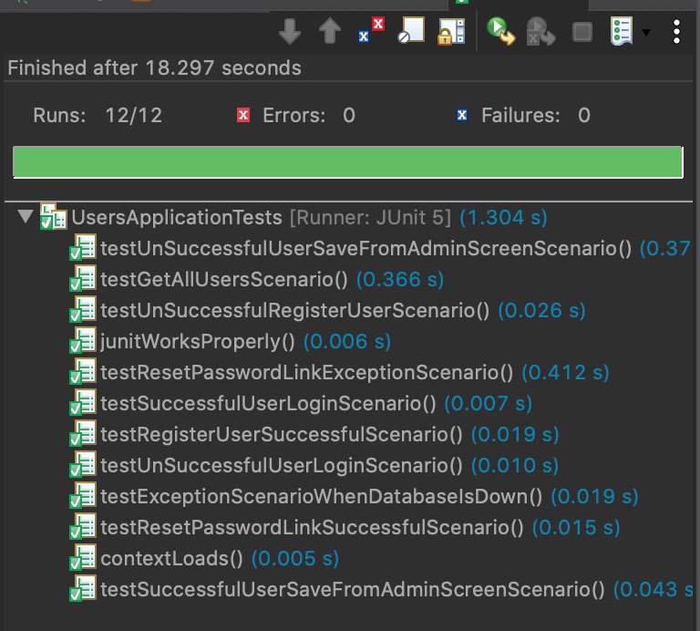

# Xtream Team

### Project Name: Secure Food Distribution App

### Team Members 
- **Prashant More**: Product Owner / Developer
- **Alexander Giannini**: Scrum Master/ Developer
- **Juan Valladares**: Developer
- **Anup Shetye**: Developer
- **Manav Agarwal**: Developer

### Product Name: 
The product is an open source using MIT licensed and it is called Supply Line Food.

### Far Vision 
 Build a solution to distribute food in underdeveloped countries.

### Near Vision Create an app that will build a basic framework for the far vision
Create web app that connect donors, non-profit orgs, vendors and families in need using QRCode technology.

### Stakeholders:
  
  - **Non-Profit User**: This stakeholder is a member of a non-profit organization and it will use the app to orchestate the distribution of food in underdeveloped countries. 

  - **Mother of Family in need**: This stakeholder use the app to create an identify in the system. The Local non-profit will coordinate the food's distribuition and locate those families that require support using the app.
  
  - **Man - Donors**: This stakeholder provide the funds to finance the process. He will use the app to donate money to the non-profit organization using creditcards or transfer money or any possible mean.  
  - **Groceries' Vendor**: Local vendors will give the groceries to the families in exchange of the funds received from the non-profit organization.  

  ### Real Person: 
  
Alejandra is a real person, is a mother of two, 31 years old who lives in Tegucigalpa, the capital city of Honduras. She works as office cleaner. Her husband work in construction. During the pandemic, both lost their jobs and have had difficulties to feed their family. Honduras, an underdeveloped country doesn’t have the resources to feed the whole country. This has been in lockdown since March and citizens can only leave their home once every 10 days. Some essential workers can go out, but they can’t because offices are closed, and construction work has been stopped. She has been struggling to feed her family and provide the basic needs. Food is one of the major issues due to the lack of job, money and they have to rely on some government assistance,  when it is possible, or non-profit such as churches or organizations that distribute food from time to time. Sometimes, they have to violate the lockdown to go out and look for groceries, or try to gain some money with temp jobs.

### Real Stakeholder

The family in need is a stakeholder that will be using the app but, at the same time, receiving the resources donated by donors.  It will sign up to request financial support, and the Non-Profit organization will give the funds when this person passes a vetting process. This process is essential because they will receive groceries with a monetary value, and it is necessary to make sure that this stakeholder requires financial assistance. 

The beneficiary will have an ID in the system, and this ID is used to identify the individual and make sure that the same person requesting help is the same person who will receive the goods at the store.
 
 
## Product Backlog
We are using Jira to manage our backlog and it can be seen this address [Jira Backlog](https://xtremeteam3.atlassian.net/secure/RapidBoard.jspa?rapidView=1&projectKey=SFDA&view=planning&selectedIssue=SFDA-1&epics=visible&issueLimit=100)

### Ordering
 
For Product Backlog ordering, we decided to first implement the signup functionality, then the login functionaly, then the core functionality and then the security. We determined that this order will allow us to properly test the application due to technical constraints. Specifically, the creating the signup and login first will allow us to build the technical framework to power the rest of the application.
 

## Definition of Ready
Title: Secure Food Distribution Application
User Story Opening Sentence: Given ... When ... Then ...
Additional Details :  listed in the stakeholder information
Acceptance Criteria: THe application should meet all criteria including all business logic and testing requirments. These Include:
    - App should allow beneficiaries to sign up and receive an ID in the system and use QR Code technology to identify themselves in the system. ESTIMATION: 63
    - App should allow donors to donate money to the organization. ESTIMATION: 37
    - App should allow the Non-Profit organization to assign the money to each beneficiary. ESTIMATION: 50
    - App should be reasonable Secure ESTIMATION: 13
    - Contact Page that can be used by any visitor ESTIMATION: 5

### Estimation
#### For Estimation, we used 'Planning Poker' to execute whole-team relative sized estimation. Only developers participated. We met as a group and estimated Story Point's with the following numbers : 1, 2, 3, 5, 8, 13, 21, 34, 55, 89. We discussed each item and determined a general approach as a team. Our conclusions were all unanimous and are listed below.

#### EPIC: Signup Capability
1. Signup capability for NPO - ESTIMATION 21
2. Signup capability for Families - ESTIMATION 21
3. Signup capability for Donors - ESTIMATION 21
#### EPIC: Login Capability
4. Login functionality for NPO - ESTIMATION: 8
5. Login functionality for Families - ESTIMATION: 8
6. Login functionality for Donors - ESTIMATION: 8
#### EPIC: Core Functions
7. Ability to retrieve QR Code For various roles ( stakeholders) - ESTIMATION: 21
8. Unique QR Code should be assigned to Families - ESTIMATION: 13
9. Donor should be able to donate money - ESTIMATION: 8
9. NPO should be able to distribute funds - ESTIMATION: 21
11. Contact Page/ Help form - ESTIMATION: 5
#### EPIC: Security
12. Implement basic web security practices - ESTIMATION: 13
'

# PRODUCT BACKLOG (REVISED)
Create Home Page: ESTIMATION 21
Story: As an App User, I need to find the App through a search engine, and therefore need a home page to land on
Acceptance Criteria: App is hosted on a web server and is serving a static webpage with basic SEO

Create QR Code : ESTIMATION 34
Story: As a Family, I need to get QR Code online to be identified for Humanitarian Relief
Acceptance Criteria: A page is created on the site that displays a unique QR Code every time is is loaded. A database is created to store each QR code and confirm unique ones are being generated

Build Registration Page : ESTIMATION 34
Story: As an app user, I need a page to register and login
Acceptance Criteria: A page must be created that allow the user to register. Upon registration a confirmation email is created.

Build Login Page : ESTIMATION 21
Story: As an app user, I need a page to login
Acceptance Criteria: A page must be created that allow the user to login. Login should not occur if username and password are not in database.

Build View Profile Feature for Families : ESTIMATION 21
Story: As a family, I need to be able to view my QR Code and current balance.
Acceptance Criteria: App allows logged in users to view their account information.

Build Edit Profile Feature : ESTIMATION 21
Story: As a family, I need to be able to edit my profile (in case of contact information change)
Acceptance Criteria: Users can edit their account information on file

Build Donor Page with Unique Account Information : ESTIMATION 21
Story: As a donor, I need to be able to view my account information and view past donations
Acceptance Criteria: Donors must be able to register and increase the amount of funds the NPO has access to

Build NPO Page For Fund Distribution : ESTIMATION 21
Story: As an NPO, I need to be able to register and login to distribute the donated funds to families
Acceptance Criteria: NPOs must be able to register and distribute the funds

Build Vendor Page to Remove Funds from Family Accounts : ESTIMATION 21
Story: As a Vendor, I need to be able to transfer money from the Fmailies Accounts to my own when I provide them goods
Acceptance Criteria: Vendors can registarer and remove funds from a family's account according to the number on their QR Code

Build Contact and Support Page : ESTIMATION 13
Story: As a App User (Families, NPO, Donors), I need to be able to contact someone with any questions about the app
Acceptance Criteria: Page is created with contact form that emails contents of form to dedicated email addresss.

Web Security : ESTIMATION 34
Story: As an App User, I need to know that my personal and financial data is secure
Acceptance Criteria: app is password protected with authorization with https and passes basic security audit.

# Sprint 1

## Sprint Planning and Sprint Goal
For our first Sprint we forecast being able to complete 75 Story Points.  
Rational: While 75 points seems like a lot, we want to be sure to build a good foundation to build upon for the rest of the application. We are hopeful we will be able to complete everything especially considering Veterans Day is Wednesday and we may have a bit more time than normal.   

## Working Application
Our Product Increment is working software and can be found at: http://ec2-54-183-160-185.us-west-1.compute.amazonaws.com:4200/. 

## Burndown Chart
The burndown chart is located in Jira [burndown chart](https://xtremeteam3.atlassian.net/secure/RapidBoard.jspa?rapidView=1&projectKey=SFDA&view=reporting&chart=burndownChart&sprint=1&estimate=issueCount_). 

We did update our Sprint Task Board and Burndown Chart. However, becasue we modified our Product Backlog, there was a delay and all of our updates are logged as being started on 11/15.  

## Kanban Board
The Kanban Board contains the tasks we planned to accomplish this sprint. [Kanban Board Sprint 1](https://xtremeteam3.atlassian.net/secure/RapidBoard.jspa?rapidView=1&projectKey=SFDA&selectedIssue=SFDA-21). 
 
## Mob Programming
We accomplished much of the first task using Mob Programming. We were able to maximize our productivity by pooling our strengths. Photos of our Mob Programming Session are included in the folder Sprint 1 Pictures.  

## Test First
We built our Application Test First. This is evidenced by ten functional test cases that all pass. The tests can be found at https://github.com/jcvalladares/xtreamteam/blob/main/sfda/src/test/java/com/sfda/users/UsersApplicationTests.java.

## Sprint 1 Backlog
The Development Team (alone) chose this Spring Backlog after we refined some the items during Product Backlog Refinment.    

Create Home Page: ESTIMATION 21. 
Story: As an App User, I need to find the App through a search engine, and therefore need a home page to land on. 
Acceptance Criteria: App is hosted on a web server and is serving a static webpage with basic SEO. 

Create QR Code : ESTIMATION 34. 
Story: As a Family, I need to get QR Code online to be identified for Humanitarian Relief. 
Acceptance Criteria: A page is created on the site that displays a unique QR Code every time is is loaded. A database is created to store each QR code and confirm unique ones are being generated. 

Build Registration Page : ESTIMATION 34. 
Story: As an app user, I need a page to register and login  
Acceptance Criteria: A page must be created that allow the user to register. Upon registration a confirmation email is created.  

## Tasks
PBI #1 Set up AWS Instance w/ security settings. 
PBI #1 Register SSH Key with Juan's GitHub. 
PBI #1 Confirm instance has Access and can pull from the repo. 
PBI #1 Create a Spring Boot App with buil-in server. 
PBI #1 Allow App to serve static files. 
PBI #1 Build and run tests for confirm everything is working. 
PBI #1 Delpoy app to server via gitHub. 
PBI #1 Build HTML Page with Basic SEO. 
  
PBI #2 Create Database or file to store QR Code  
PBI #2 Build HTML Page with Bootstrap    
PBI #2 Page displays a QR Code using an API. 
PBI #2 Build and run tests for confirm everything is working. 
  
PBI #3 Build HTML with Bootstrap and a form that receives information. 
PBI #3 Allow Users to create an user entry in the database/file. 
PBI #3 Build and run tests for confirm everything is working. 
  

# Sprint 1 Daily Scrums. 
  
## 11/11 Daily Scrum. 
At 6pm our Development had the Daily Scrum. 

### Past 24 Hours. 
In the past 24 Hours we all spent time researching different web development approaches that we may want to use:    

Alex G - had built a Vue app. 
Manav had found a Template that uses Spring with Vue. 
Juan - Created an Angular Project and explored how Spring Works. 
Anup - Started to work with Spring Board and React JS  

### Impediments
Impediment: We have not all agreed on a technology to use. 
Solution: We will continue to discuss and will build as necessary. We will also see what technology works best as we go.  

Impediment: Our Product Backlog Items need to be redone. 
Solution: We will refine our product Backlog before the end of the meeting today.  

Impediment: We do not have an updated burndown chart. 
Solution: Prashant will add the new product backlog items to the chart once we complete the Product Backlog Revision. 

### Next 24 Hours. 
Mob Programming Session to deploy trivial app on Development Environment. 
Continue building test cases. 
Continue researching front-end options (Vue, React, Angular). 

## 11/15 Daily Scrum
At 4pm our Development had the Daily Scrum.

### Past 24 Hours
Alex G - Researched QR api information. 
Anup - Created Test Cases for the PBI's
Manav - Worked on QR Code Generation and server deployment
Prashant - Updated the Sprint Backlog on Jira
Juan - Completed the HTML for the Home Page Login and Signup

### Impediments

We did not forsee any impediments moving forward

### Next 24 Hours
As a team, we are planning to Mob Program and also prepare for the Sprint Retrospective.

